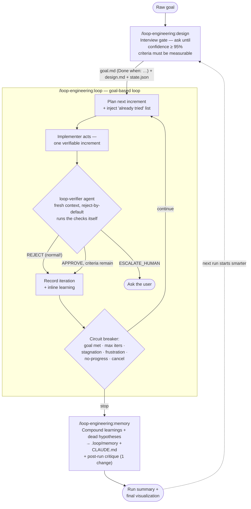
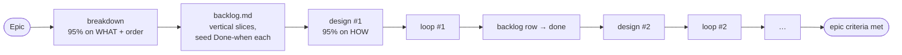
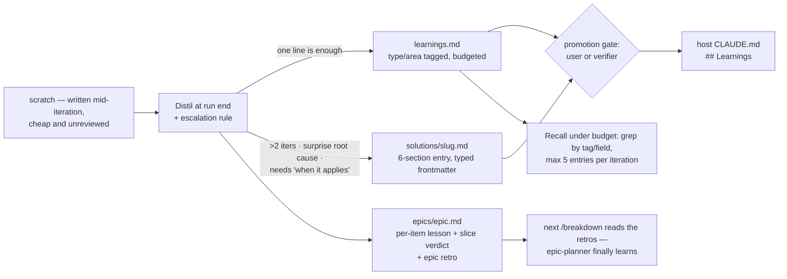

# loop-engineering

A Claude Code plugin implementing **goal-based engineering loops**: a
confidence-gated design step, persistent plan→act→verify iteration toward a
verifiable goal, **compounding memory** after every run, and mermaid
visualization of the loop's execution.

Inspired by Claude's [Getting started with loops](https://claude.com/blog/getting-started-with-loops)
(goal-based loop), [cobusgreyling/loop-engineering](https://github.com/cobusgreyling/loop-engineering),
and the memory-compounding pattern of
[EveryInc/compound-engineering-plugin](https://github.com/EveryInc/compound-engineering-plugin).

## Install (import into any project)

```
/plugin marketplace add huvii174/loop-engineering-plugin
/plugin install loop-engineering@loop-engineering-marketplace
```

(Equivalent CLI: `claude plugin marketplace add huvii174/loop-engineering-plugin`
then `claude plugin install loop-engineering@loop-engineering-marketplace`.
From a local clone, pass the directory path to `marketplace add` instead.)

**Three similar names — don't mix them up:**

| Name | What it is | Where you use it |
|---|---|---|
| `loop-engineering-plugin` | the GitHub **repo** | `marketplace add huvii174/loop-engineering-plugin` |
| `loop-engineering-marketplace` | the **marketplace** declared inside it | the part after `@` in `plugin install` |
| `loop-engineering` | the **plugin** itself | `plugin install loop-engineering@…`, command prefix `/loop-engineering:…` |

**Update gotcha:** `claude plugin install` does **not** upgrade an existing
install. To get a new version: `claude plugin marketplace update
loop-engineering-marketplace` then `claude plugin update
loop-engineering@loop-engineering-marketplace`, and restart the session to apply.

**⚠ Restart is not optional.** A session started before an install/update keeps
serving the OLD command text and — worse — leaves the hooks **inert**, while
`claude plugin list` happily reports the new version. Nothing warns you. Two
skew tells: the breaker prints `[plugin vX.Y.Z]` read from disk on every check
(compare it against the behavior you're seeing), and a skill/agent named in
this README that fails to resolve in-session means the session predates the
install. When in doubt: restart.

## The loop



Design choices grounded in the sources: the exit is gated by a **separate
fresh-context verifier**, not the implementer's own judgment (the blog's core
goal-based-loop mechanism; loop-engineering's maker/checker split — "the
implementer never grades itself"). Stop conditions form a **circuit breaker**
(stagnation / frustration / no-progress / budget) rather than a single retry
cap, and failed iterations feed an "already tried — do not repeat" list into the
next one.

### The breaker is code, not a prompt

`scripts/loop-breaker.mjs` (zero dependencies, runs on the Node that ships with
Claude Code) reads `.loop/state.json` and decides deterministically:

```bash
node "${CLAUDE_PLUGIN_ROOT}/scripts/loop-breaker.mjs"            # 0 continue · 2 stop · 1 state error
node "${CLAUDE_PLUGIN_ROOT}/scripts/loop-breaker.mjs" --context   # "already tried" block
node "${CLAUDE_PLUGIN_ROOT}/scripts/loop-breaker.mjs" --json      # machine-readable verdict
```

The loop runs it before every iteration and cannot overrule exit `2`. Failure
signatures are normalized (timestamps, hex addresses, paths → basenames, numbers
→ `#`) so "the same error" survives volatile detail; approach similarity is
trigram Jaccard raised by containment at 0.85, so a reworded retry still counts
as a repeat. Thresholds are per-loop via a `breaker` object in `state.json`;
`breaker_reset_at_iteration` clears counters when a `stuck` loop resumes.
Verify with `node scripts/test-loop-breaker.mjs` (16 checks).

### Hooks — enforcement, not capture

Three deterministic hooks close the one gap prompts can't: everything else in
this plugin runs *inside* the loop, so nothing could catch a session that ends
mid-habit. All three are stat/glob/string checks only (no model calls), exit in
microseconds when a project has no `.loop/`, **fail open** on any error, and can
be disabled with `LOOP_HOOKS_OFF=1`.

| Hook | Event | What it does |
|---|---|---|
| `boundary-gate` | PreToolUse (Edit/Write) | While a loop is `running`, blocks edits to paths under `Do not touch:` lines in goal.md's `## Global boundaries` — a Must-not upgraded from verifier-caught to mechanically impossible |
| `memory-gate` | Stop | Blocks ending the session (once) when the loop reached a terminal state but `.loop/memory/` wasn't touched afterwards, or scratch entries were never distilled — "every run leaves the system smarter", enforced |
| `loop-reminder` | SessionStart | One context line when the project has an open (`running`/`stuck`) loop, so a new session can't forget it |

Deliberately NOT hooks: memory *capture* (distilling needs judgment — that stays
model-invoked) and self-evaluation (the breaker already runs as code inside the
loop). Verify with `node scripts/test-hooks.mjs` (18 checks).

## Commands

| Command | What it does |
|---|---|
| `/loop-engineering:breakdown "<epic>"` | BA/PM gate for big goals: epic-level 95%-confidence interview (WHAT/why/order — never implementation), then the `epic-planner` agent proposes vertical-slice sub-goals with seed `Done when:` lines, dependencies, and risk-first ordering; you sign off; writes `.loop/epics/<slug>/epic.md` + `backlog.md` (one instance dir per epic — epics never overwrite each other; `.loop/active-epic` points at the one in play, and closed epics are archived while their knowledge rollup in `.loop/memory/epics/` lives on). Each sub-goal then goes through the design gate one at a time. |
| `/loop-engineering:design "<goal>"` | Interview-gated design: asks targeted questions round by round, stating its confidence (%) after each, and only writes `.loop/goal.md` + `.loop/design.md` once confidence ≥ 95% (or you sign off its explicit assumptions). Reads memory first so it never re-asks answered questions. The finished design then faces the **tenth-man `plan-critic`** — a fresh-context agent obliged to assume the signed-off plan is wrong and attack it with evidence (max 2 revise rounds; approvals carry the surviving dissent on record; trivial designs skip it visibly). |
| `/loop-engineering:loop [max]` | Runs the goal-based loop: one small verifiable increment per iteration, evidence-based verification against the success criteria, append-only iteration records, resumable from `.loop/state.json`. Fails don't stop it — bounded stop conditions do. When the last criterion passes, a **review gate** fans out parallel fresh-context reviewers (correctness always; security / test-adequacy / simplification only when their triggers fire), refutes findings before believing them, and feeds confirmed ones back in as normal iterations — only a cleared gate writes `done`. |
| `/loop-engineering:status` | Read-only dashboard: mermaid pipeline with current position, iteration timeline, success-criteria checklist with evidence, delegated agents, next action. |
| `/loop-engineering:memory` | Compounding step — the loop performs the same procedure inline at every stop: harvest → distill → merge learnings into `.loop/memory/`, promote repo-wide facts into the host `CLAUDE.md`, prune to keep memory readable. |

## State layout (created in your project)

```
.loop/
  active-epic      # (epics only) one line: the epic slug currently in play
  epics/<slug>/    # (epics only) one instance dir PER epic — never overwritten:
                   #   epic.md (statement + acceptance) + backlog.md (items + status)
                   #   closed epics move to archive/epics/<slug>/
  goal.md          # ACTIVE goal + verifiable success-criteria checklist
  design.md        # architecture + ordered work breakdown
  state.json       # loop position — makes the loop resumable
  iterations/      # one append-only record per iteration
  archive/<run>/   # finished sub-goal runs, moved here by the design gate
  memory/
    learnings.md   # tagged one-liners + "## Never store" + this run's scratch
    solutions/     # full entries for non-trivial solved problems (typed frontmatter)
    epics/         # per-epic rollup: what each sub-goal taught + epic retro
    decisions.md   # decisions + rejected alternatives
```

## Epic flow (big goals)



Sub-goals run sequentially against one `.loop/` by default; truly independent
items can run in parallel git worktrees (one `.loop/` each).

## Memory compounding

Memory combines two lineages: **tiering and promotion governance** from
[memory-engineering](https://github.com/cobusgreyling/memory-engineering) with
**per-entry craft, greppable retrieval and garbage collection** from
compound-engineering.



**One size does not fit all knowledge.** A one-liner is right when the action
*is* the knowledge ("run `pnpm test --filter api`, not the full suite — needs
docker"). It is wrong for a debugging journey: compressing that to one line keeps
the conclusion but loses the discrimination that tells a future session whether
the entry even applies. So the escalation rule is explicit rather than a judgment
call — **>2 iterations, or a root cause that differed from the first hypothesis,
or "when does this apply?" needing more than one line** → a full `solutions/`
entry with `What didn't work` and `When this applies` sections.

**Epic knowledge compounds too.** Every sub-goal stop appends what it taught *and
a slice verdict* (`well-sliced` / `too coarse` / `too fine` / `wrong boundary`) to
the epic rollup; the last item writes a retro naming exactly one change for the
next breakdown. `/loop-engineering:breakdown` reads those retros **first** and
treats them as binding — without that link `epic-planner` would re-propose the
same bad slices forever.

**Nothing reaches the host `CLAUDE.md` unreviewed.** That file loads into every
future session, so promotion requires the user or the verifier agent, and scratch
is never promoted directly. Recall runs under a budget — retrieval without one is
just context spam.

## Design-gate prompt (the 95% rule)

The design command will not produce a design until it can state ≥95% confidence
that it understands the goal, constraints, success criteria, and edge cases well
enough to complete the goal correctly — and it must show its confidence estimate
and remaining ambiguities after every round of questions. If 95% is unreachable,
it lists explicit assumptions and gets your sign-off instead of guessing silently.
