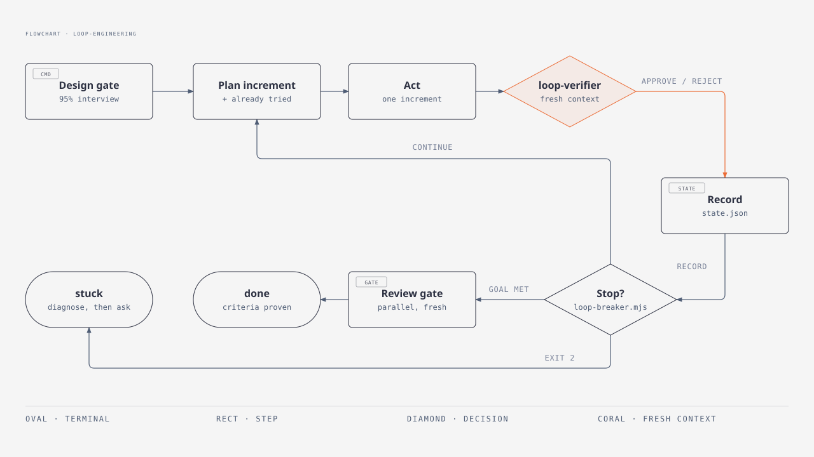
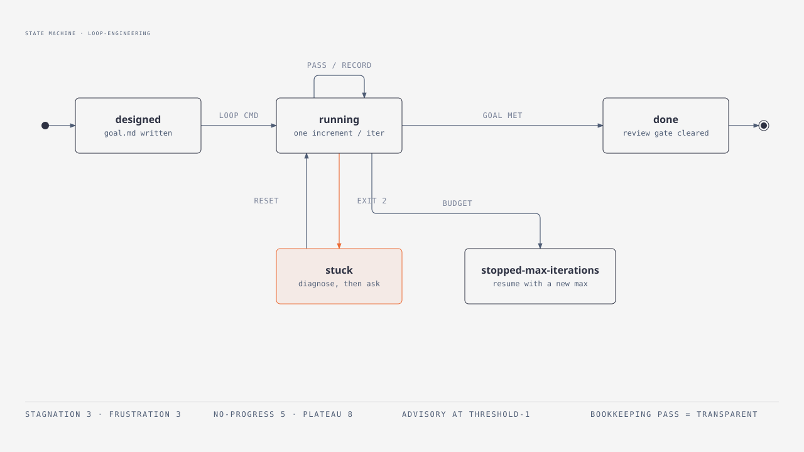
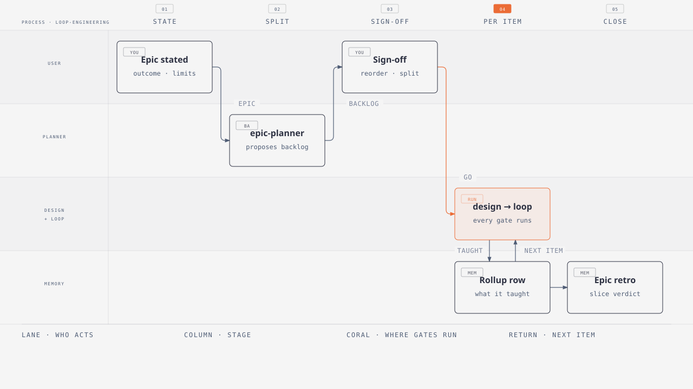
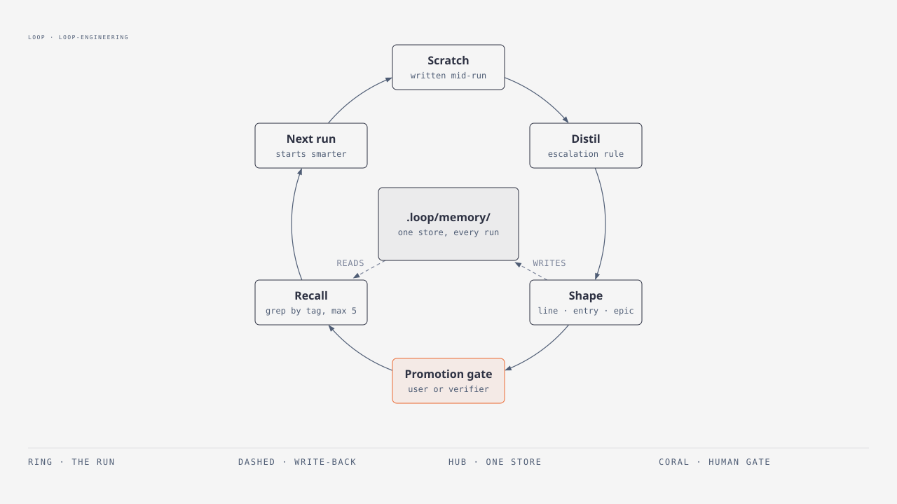
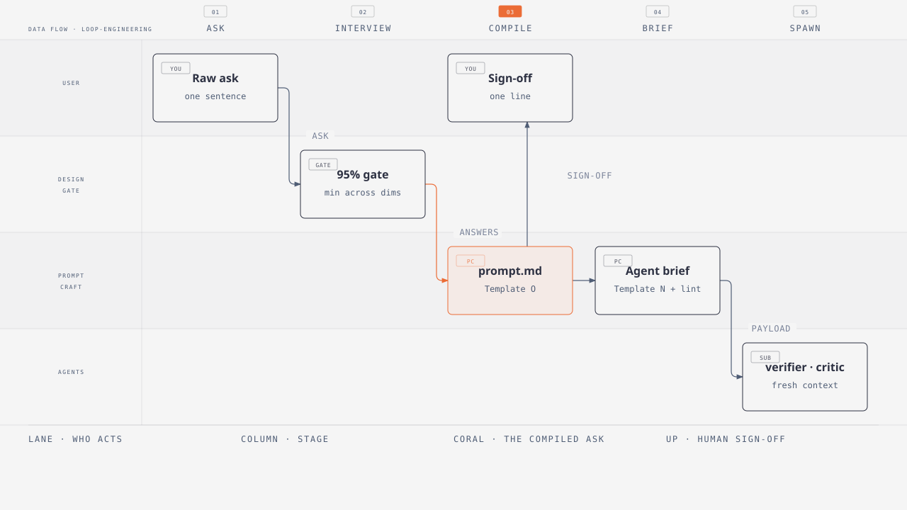

# loop-engineering

A Claude Code plugin implementing **goal-based engineering loops**: a
confidence-gated design step that compiles your ask into an engineered brief,
persistent plan→act→verify iteration toward a verifiable goal, evidence matched
to the surface it lives on, **compounding memory** after every run, and mermaid
visualization of the loop's execution.

Inspired by Claude's [Getting started with loops](https://claude.com/blog/getting-started-with-loops)
(goal-based loop), [cobusgreyling/loop-engineering](https://github.com/cobusgreyling/loop-engineering),
and the memory-compounding pattern of
[EveryInc/compound-engineering-plugin](https://github.com/EveryInc/compound-engineering-plugin).
Prompt-engineering knowledge is adapted from
[nidhinjs/prompt-master](https://github.com/nidhinjs/prompt-master); the honest-counter,
evidence-routing and memory-lifecycle rules are adapted from
[deepseek-ai/deepseek-harness](https://github.com/deepseek-ai/deepseek-harness).

## What ships

| Kind | Name | Job |
|---|---|---|
| command | `breakdown` · `run` · `design` · `loop` · `status` · `memory` | the six entry points (table below) |
| skill | `interview` | the questioning method: design tree, frontier rounds, the two-part gate, the escape hatch |
| skill | `loop-engine` | `.loop/` state contract, iteration record format, breaker semantics, tier routing |
| skill | `loop-memory` | index/body split, four memory shapes, promotion gate, entry lifecycle, recall budget, calibration examples |
| skill | `loop-review` | the review gate: parallel fresh-context reviewers, adversarial refutation |
| skill | `prompt-craft` | compiles the ask into `.loop/prompt.md`; composes every `Agent()` brief |
| agent | `loop-verifier` | per-iteration verdict, reject-by-default, owns the evidence routing table |
| agent | `plan-critic` | tenth man against the signed-off design, before any iteration runs |
| agent | `epic-planner` | proposes the backlog; never designs, never edits |
| hook | `boundary-gate` · `memory-gate` · `loop-reminder` · `memory-recall` | the deterministic layer (see below) |
| script | `loop-breaker.mjs` | the circuit breaker, as code rather than as a prompt |
| script | `loop-record.mjs` | the only writer of `state.json.history` — holds the verdict enum, reconciles the recall inbox, refuses rather than half-writes |
| script | `loop-archive.mjs` | run/epic archiving, hygiene sweep, retention — deterministic, so the layout cannot drift (`run` · `epic` · `hygiene` · `prune`; all support `--dry-run`, `prune` is dry until `--yes`) |
| script | `migrate-memory.mjs` | one-way migration of a flat memory store into the index/body tree |

## Install (import into any project)

```
/plugin marketplace add huvii174/loop-engineering-plugin
/plugin install loop-engineering@loop-engineering-marketplace
```

(Equivalent CLI: `claude plugin marketplace add huvii174/loop-engineering-plugin`
then `claude plugin install loop-engineering@loop-engineering-marketplace`.
From a local clone, pass the directory path to `marketplace add` instead.)

**Three similar names — don't mix them up:**

| Name | What it is | Where you use it |
|---|---|---|
| `loop-engineering-plugin` | the GitHub **repo** | `marketplace add huvii174/loop-engineering-plugin` |
| `loop-engineering-marketplace` | the **marketplace** declared inside it | the part after `@` in `plugin install` |
| `loop-engineering` | the **plugin** itself | `plugin install loop-engineering@…`, command prefix `/loop-engineering:…` |

**Update gotcha:** `claude plugin install` does **not** upgrade an existing
install. To get a new version: `claude plugin marketplace update
loop-engineering-marketplace` then `claude plugin update
loop-engineering@loop-engineering-marketplace`, and restart the session to apply.

**⚠ Restart is not optional.** A session started before an install/update keeps
serving the OLD command text and — worse — leaves the hooks **inert**, while
`claude plugin list` happily reports the new version. Nothing warns you. Two
skew tells: the breaker prints `[plugin vX.Y.Z]` read from disk on every check
(compare it against the behavior you're seeing), and a skill/agent named in
this README that fails to resolve in-session means the session predates the
install. When in doubt: restart.

## The loop

<picture>
  <source media="(prefers-color-scheme: dark)" srcset="docs/diagrams/loop-lifecycle-dark.svg">
  
</picture>

Design choices grounded in the sources: the exit is gated by a **separate
fresh-context verifier**, not the implementer's own judgment (the blog's core
goal-based-loop mechanism; loop-engineering's maker/checker split — "the
implementer never grades itself"). Stop conditions form a **circuit breaker**
(stagnation / frustration / no-progress / budget) rather than a single retry
cap, and failed iterations feed an "already tried — do not repeat" list into the
next one.

### The breaker is code, not a prompt

<picture>
  <source media="(prefers-color-scheme: dark)" srcset="docs/diagrams/circuit-breaker-dark.svg">
  
</picture>

`scripts/loop-breaker.mjs` (zero dependencies, runs on the Node that ships with
Claude Code) reads `.loop/state.json` and decides deterministically:

```bash
node "${CLAUDE_PLUGIN_ROOT}/scripts/loop-breaker.mjs"            # 0 continue · 2 stop · 1 state error
node "${CLAUDE_PLUGIN_ROOT}/scripts/loop-breaker.mjs" --context   # "already tried" block
node "${CLAUDE_PLUGIN_ROOT}/scripts/loop-breaker.mjs" --json      # machine-readable verdict
```

The loop runs it before every iteration and cannot overrule exit `2`. Failure
signatures are normalized (timestamps, hex addresses, paths → basenames, numbers
→ `#`) so "the same error" survives volatile detail; approach similarity is
trigram Jaccard raised by containment at 0.85, so a reworded retry still counts
as a repeat. Thresholds are per-loop via a `breaker_thresholds` object in
`state.json`; `breaker_reset_at_iteration` clears counters when a `stuck` loop
resumes. The field holds **thresholds, never counters** — counters are recomputed
from `history` on every run — so a non-positive value is refused in favour of the
default with a warning naming the field. (The former spelling `breaker` is still
read; setting both warns and prefers the new one.) Verify with
`node scripts/test-loop-breaker.mjs` (42 checks).

Two rules keep those counters honest, both derived from recorded state rather
than from anything the loop says about itself. **Bookkeeping passes are
transparent to the failure chain**: a passing iteration that closed no criterion
(`criteria_passed` did not rise) neither counts as an attempt nor resets one, so
`fail → tidy the records → fail` still reads as two consecutive failures.
Recording work is not progress and must not be able to launder a stuck loop;
fails are never transparent, so labelling a failure as bookkeeping buys nothing.
And **one counter short of a threshold prints an `ADVISORY` and still exits
`0`** — the loop gets one warning it can act on (change the approach, target a
criterion, split the increment) before the breaker takes the decision away. An
advisory never stops a run: a nudge that can halt the loop is a stop condition
wearing a disguise.

### Hooks — enforcement, not capture

Four deterministic hooks close the gaps prompts can't: everything else in
this plugin runs *inside* the loop, so nothing could catch a session that ends
mid-habit — or one that never typed a slash command at all. All are
stat/glob/string checks only (no model calls), exit in microseconds when a
project has no `.loop/`, **fail open** on any error, and can be disabled with
`LOOP_HOOKS_OFF=1`.

| Hook | Event | What it does |
|---|---|---|
| `boundary-gate` | PreToolUse (Edit/Write) | While a loop is `running`, blocks edits to paths under `Do not touch:` lines in goal.md's `## Global boundaries` — a Must-not upgraded from verifier-caught to mechanically impossible |
| `memory-gate` | Stop | Blocks ending the session (once) when the loop reached a terminal state but `.loop/memory/` wasn't touched afterwards, scratch was never distilled, recalled entries were never accounted for in a `Recall:` line, or an `_index.md` is over its reading budget. **Ad-hoc branch:** with no loop involved, if the session edited files while working through errors and captured nothing, nudges once for a one-liner in `scratch/adhoc.md` |
| `loop-reminder` | SessionStart | One context line when the project has an open (`running`/`stuck`) loop, plus a **memory digest** (what `.loop/memory/` holds) so ad-hoc sessions know the store exists |
| `memory-recall` | UserPromptSubmit | **Ambient recall** — keyword-matches the indexes against each (non-slash) user prompt. A strong match arrives with its **body already inlined**; weaker ones arrive as a trigger plus the exact `grep` that opens the body — a pointer nobody follows is a recall that did not happen. 5-entry budget, labeled supplementary, injected IDs logged to `.loop/.recall-log` |

Deliberately NOT hooks: memory *distillation* (needs judgment — the ad-hoc nudge
collects raw one-liners, but only `/loop-engineering:memory` turns scratch into
durable entries) and self-evaluation (the breaker already runs as code inside the
loop). Verify with `node scripts/test-hooks.mjs` (59 checks); the scripts have
their own suites — `test-loop-breaker.mjs` (42), `test-loop-archive.mjs` (49),
`test-migrate-memory.mjs` (87).

## Commands

| Command | What it does |
|---|---|
| `/loop-engineering:breakdown "<epic>"` | BA/PM gate for big goals: epic-level interview (WHAT/why/order — never implementation) run to the same two-part gate as `design`, then the `epic-planner` agent proposes vertical-slice sub-goals with seed `Done when:` lines, dependencies, and risk-first ordering; you sign off; writes `.loop/epics/<slug>/epic.md` + `backlog.md` (one instance dir per epic — epics never overwrite each other; `.loop/active-epic` points at the one in play, and closed epics are archived while their knowledge rollup in `.loop/memory/epics/` lives on). Each sub-goal then goes through the design gate one at a time. |
| `/loop-engineering:run [slug] [--hands-off]` | Epic runner: executes the signed-off backlog end-to-end in dependency order — no more typing `design` per item. Front-loads every interview in a batched pre-flight (an autonomous run must never count on asking mid-flight), then drives each item through the full design→loop→memory pipeline with every gate intact. One `stuck` item stops the runner; `--hands-off` trades questions for explicit assumptions + mandatory tenth-man on every item. Parallelism is opt-in and worktree-only. |
| `/loop-engineering:design "<goal>"` | Interview-gated design: maps the ask as a design tree and asks the whole **frontier** each round — every question numbered, each carrying its recommended answer — while facts it can look up itself go to a subagent instead of to you. Once the frontier is empty **and** min-dimension confidence ≥ 95% (or you sign off its explicit assumptions) it first **compiles your ask** into `.loop/prompt.md` for a one-line sign-off, then writes `.loop/goal.md` + `.loop/design.md`. Reads memory first so it never re-asks answered questions. The finished design then faces the **tenth-man `plan-critic`** — a fresh-context agent obliged to assume the signed-off plan is wrong and attack it with evidence (max 2 revise rounds; approvals carry the surviving dissent on record; trivial designs skip it visibly). |
| `/loop-engineering:loop [max]` | Runs the goal-based loop: one small verifiable increment per iteration, evidence-based verification against the success criteria, append-only iteration records, resumable from `.loop/state.json`. Fails don't stop it — bounded stop conditions do. An increment that **fixes** something runs the defect protocol first: one command that goes red on this defect, already run once, before any theory. When the last criterion passes, a **review gate** fans out parallel fresh-context reviewers (correctness always; spec fidelity, security, test-adequacy and simplification when their triggers fire), refutes findings before believing them, reports per dimension without reranking across them, and feeds confirmed ones back in as normal iterations — only a cleared gate writes `done`. |
| `/loop-engineering:status` | Read-only dashboard: mermaid pipeline with current position, iteration timeline, success-criteria checklist with evidence, delegated agents, breaker counters with any standing advisory, next action. |
| `/loop-engineering:memory` | Compounding step — the loop performs the same procedure inline at every stop: harvest → distill → merge learnings into `.loop/memory/`, promote repo-wide facts into the host `CLAUDE.md`, then a **hit-rate pass** that reads `.loop/.recall-log` against the run's `Recall:` lines to find triggers that over-match, and the correct entries nobody could reach. Pruning consolidates and demotes; bodies are never trimmed for size. |

## State layout (created in your project)

```
.loop/
  active-epic      # (epics only) one line: the epic slug currently in play
  epics/<slug>/    # (epics only) one instance dir PER epic — never overwritten:
                   #   epic.md (statement + acceptance) + backlog.md (items + status)
                   #   closed epics move to archive/epics/<slug>/
  prompt.md        # the ask, compiled after the 95% gate and signed off by you
  goal.md          # ACTIVE goal + verifiable success-criteria checklist
  design.md        # architecture + ordered work breakdown
  state.json       # loop position — makes the loop resumable
  iterations/      # one append-only record per iteration
  archive/<run>/   # finished sub-goal runs, moved here by the design gate
  .recall-log      # IDs auto-recall injected — what each run's `Recall:` line answers to
  parallel.json    # worktree slices, when a run fans out (absent otherwise)
  memory/
    learnings/
      _index.md    # TRIGGERS: one <=200-char line per entry + "## Never store".
                   # The only half read by default — this is what stays flat.
      env.md · gotchas.md · patterns.md · dead-ends.md
                   # BODIES: uncapped, reached by `### L-NNN` anchor when a trigger fires
    decisions/
      _index.md · durable.md · <epic-slug>/item-<N>.md
                   # sharded by epic so an epic's decisions retire with it;
                   # supersede links (not the directory) carry the history
    solutions/     # full entries for non-trivial solved problems (typed frontmatter)
    epics/         # per-epic rollup: what each sub-goal taught + epic retro
    scratch/
      run.md       # this run's raw notes    adhoc.md  # captured OUTSIDE loop runs
                   # both emptied by every /loop-engineering:memory run
```

**Why the store splits in two.** A long-lived project's knowledge grows without
bound; what must stay flat is the cost of reading it by default. So growth lands
in bodies, which are unbounded and cold, while the index grows only with the
number of distinct *kinds* of problem — and the consolidation trigger keeps
pushing it back toward kinds. Migrate an existing flat store with
`node "$CLAUDE_PLUGIN_ROOT"/scripts/migrate-memory.mjs --dry-run` first (in a
host project the script lives in the plugin install dir, not your repo — easiest
is to ask Claude, whose commands resolve that variable); it renames the sources
to `*.pre-migration` rather than deleting them.

## Epic flow (big goals)

<picture>
  <source media="(prefers-color-scheme: dark)" srcset="docs/diagrams/epic-flow-dark.svg">
  
</picture>

Sub-goals run sequentially against one `.loop/` by default; truly independent
items can run in parallel git worktrees (one `.loop/` each).

## Memory compounding

Memory combines two lineages: **tiering and promotion governance** from
[memory-engineering](https://github.com/cobusgreyling/memory-engineering) with
**per-entry craft, greppable retrieval and garbage collection** from
compound-engineering.

<picture>
  <source media="(prefers-color-scheme: dark)" srcset="docs/diagrams/memory-compounding-dark.svg">
  
</picture>

**One size does not fit all knowledge.** A one-liner is right when the action
*is* the knowledge ("run `pnpm test --filter api`, not the full suite — needs
docker"). It is wrong for a debugging journey: compressing that to one line keeps
the conclusion but loses the discrimination that tells a future session whether
the entry even applies. So the escalation rule is explicit rather than a judgment
call — **>2 iterations, or a root cause that differed from the first hypothesis,
or "when does this apply?" needing more than one line** → a full `solutions/`
entry with `What didn't work` and `When this applies` sections.

**Epic knowledge compounds too.** Every sub-goal stop appends what it taught *and
a slice verdict* (`well-sliced` / `too coarse` / `too fine` / `wrong boundary`) to
the epic rollup; the last item writes a retro naming exactly one change for the
next breakdown. `/loop-engineering:breakdown` reads those retros **first** and
treats them as binding — without that link `epic-planner` would re-propose the
same bad slices forever.

**Nothing reaches the host `CLAUDE.md` unreviewed.** That file loads into every
future session, so promotion requires the user or the verifier agent, and scratch
is never promoted directly. Recall runs under a budget — retrieval without one is
just context spam — and what it hands over is accounted for: every injected ID is
marked `applied` or `dismissed with a reason` in the run's record, because memory
read and silently ignored is indistinguishable from memory never read.

**Entries have a lifecycle, and the destructive end of it has rules.** A
decision without the alternatives it beat is not recorded but asserted, so
`alternatives rejected:` is mandatory. A dead end is kept only while the path it
names is still tempting and deleted once its premise is gone. An entry is never
edited into a different conclusion: it is replaced, or superseded by an entry
that links back. A consolidation transfers every unique rationale, alternative
and failed attempt before the absorbed entry disappears. `.loop/archive/` is
frozen: history to read, never authority to cite. And because rules alone do not
decide the hard cases, the skill carries **worked keep/delete/demote examples**
with their lengths, plus the reminder that length and age are discovery aids
rather than criteria — and that the index budget is a trigger to run
maintenance, never a quota to prune toward. What relieves it is **Consolidate**
and **Demote**, not deletion: a body costs nothing until its trigger fires, so a
grounded entry loses its index line long before it loses its knowledge.

**Evidence is matched to the surface it lives on.** Each `Done when:` names the
surface (behavior, CLI output, model-visible text, docs, published artifact,
migration, performance, deletion) and the narrowest check that would fail if the
work were wrong; `loop-verifier` carries the routing table and refuses a broad
green suite offered in place of the missing narrow check. `ESCALATE_HUMAN`
carries a proof burden of its own — command, exact error, the unchanged retry,
and what makes the failure environmental — because escalate entries are excluded
from the breaker's counters, and an escalation nobody has to justify is the
cheapest way to launder a stuck loop.

## The interview gate (frontier + the 95% rule)

`design` and `breakdown` share one questioning method (the `interview` skill).
It maps the ask as a **design tree** — every decision branching into the ones
hanging off it — and asks the **frontier** each round: every question whose
prerequisites are already settled, so nothing is answered on top of a guess
about a question still open. Batch size follows that dependency rather than a
cap, because the scarce resource is your round-trips. Every question carries the
model's recommended answer, so a round you agree with closes in one line. Facts
it could look up itself (what the code does today, what a config holds) go to a
subagent rather than to you; only the questions downstream of that lookup wait.

The gate has two parts and needs both: the **frontier is empty** (structural, and
you can read the rounds back and say "you never asked about X") **and**
**min(dimensions) ≥ 95%** (depth — the minimum, never the average, so 99% on
scope cannot hide 70% on edge cases). If the gate is unreachable after ~5 rounds,
or you say "just go", it lists numbered assumptions with their defaults and gets
your sign-off instead of guessing silently.

## Prompt compilation (what happens after the 95% gate)

<picture>
  <source media="(prefers-color-scheme: dark)" srcset="docs/diagrams/prompt-compilation-dark.svg">
  
</picture>

A goal can survive the interview and still reach the model in a shape that
loses half of it. The `prompt-craft` skill closes that gap, and it does exactly
two things.

It compiles the ask. Between the confidence gate and the design artifacts, the
design command writes `.loop/prompt.md`: objective, carry-forward context,
target state, scope, constraints, acceptance criteria, stop conditions, and
your original words quoted verbatim as inert evidence. Compilation restates
what the interview settled; it may not add scope. If compiling exposes a
decision nobody made, that is a gate failure, so the interview reopens for one
round or the gap becomes a numbered assumption. You sign the brief off in one
line, and its criteria travel into `goal.md` as `Done when:` plus `Must not:`
pairs.

It composes every agent brief. No `Agent()` in this plugin is spawned from an
ad-hoc sentence. The verifier, the tenth-man critic, the epic planner, the
review-gate reviewers and any executor the Act step delegates to all receive
the same brief shape: absolute project root, one deliverable, inputs as paths
rather than pasted bodies, forbidden actions, an explicit output contract, and
stop conditions. A six-point lint runs before the spawn. The reasoning is
mechanical: a subagent has fresh context, one turn, and no way to ask what you
meant.

The prompt-engineering body of knowledge behind it (37 failure patterns,
templates A to O, and per-tool routing for everything from Claude Code to
Midjourney) lives in `skills/prompt-craft/references/`, adapted from
[nidhinjs/prompt-master](https://github.com/nidhinjs/prompt-master) v1.7.0
(MIT) and rewired around this plugin's gates.
