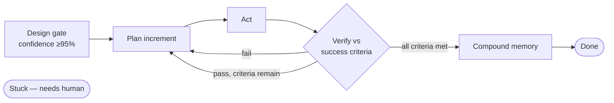

# /loop-engineering:status — Loop Visualization

Read `.loop/state.json`, `.loop/goal.md`, and all `.loop/iterations/*.md`, then
render the loop's execution so a human can grasp it at a glance. If `.loop/`
doesn't exist, say so and point to `/loop-engineering:design`.

Produce, in this order:

## 1. Loop pipeline (mermaid flowchart)

A flowchart of the loop with the current position highlighted:

Highlight exactly one node with `style <node> fill:#f9a825,color:#000`, chosen
by `state.json.status`:

| status | node |
|---|---|
| `designed` | `D` |
| `running` | `P`, `A`, or `V` per the last iteration record's stage |
| `done` | `E` |
| `stuck`, `stopped-max-iterations`, `stopped-user` | `X` |

## 2. Iteration timeline (mermaid)

One node per completed iteration from `.loop/iterations/`, labeled
`NNNN: <one-line intent> (✓/✗)`, chained in order, so failures and retries are
visible.

## 3. Success criteria progress

A checklist table from `.loop/goal.md`: criterion | status (✅/⬜) | evidence
(file/command from the iteration that proved it). Count only items under
`## Success criteria` — never `## Open questions` or assumptions.

## 4. Agents & processes

From the `Delegated:` line of each iteration record: iteration | agent | task |
outcome. Omit this section if every record says "none".

## 5. One-paragraph plain summary

Where the loop stands, iterations used vs budget, and the single next action.

Keep the whole output compact — this is a dashboard, not a report. Do not modify
any `.loop/` files from this command; it is read-only.
